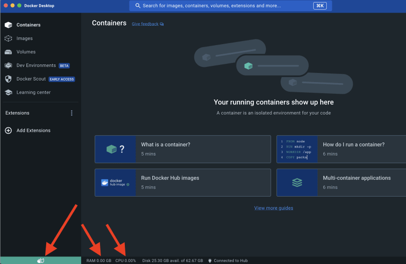
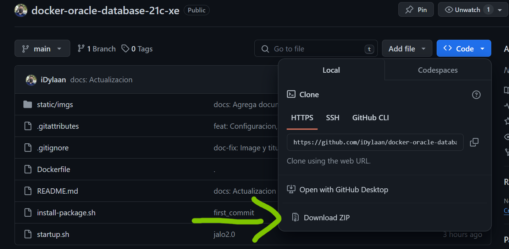
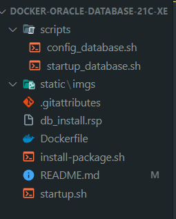
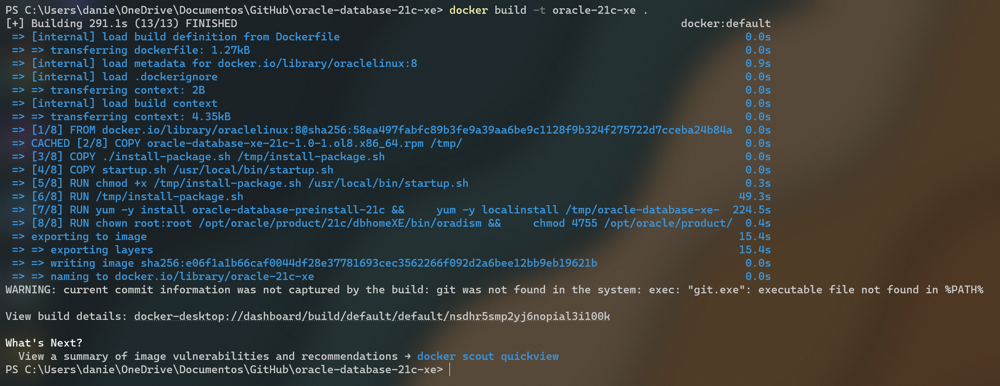
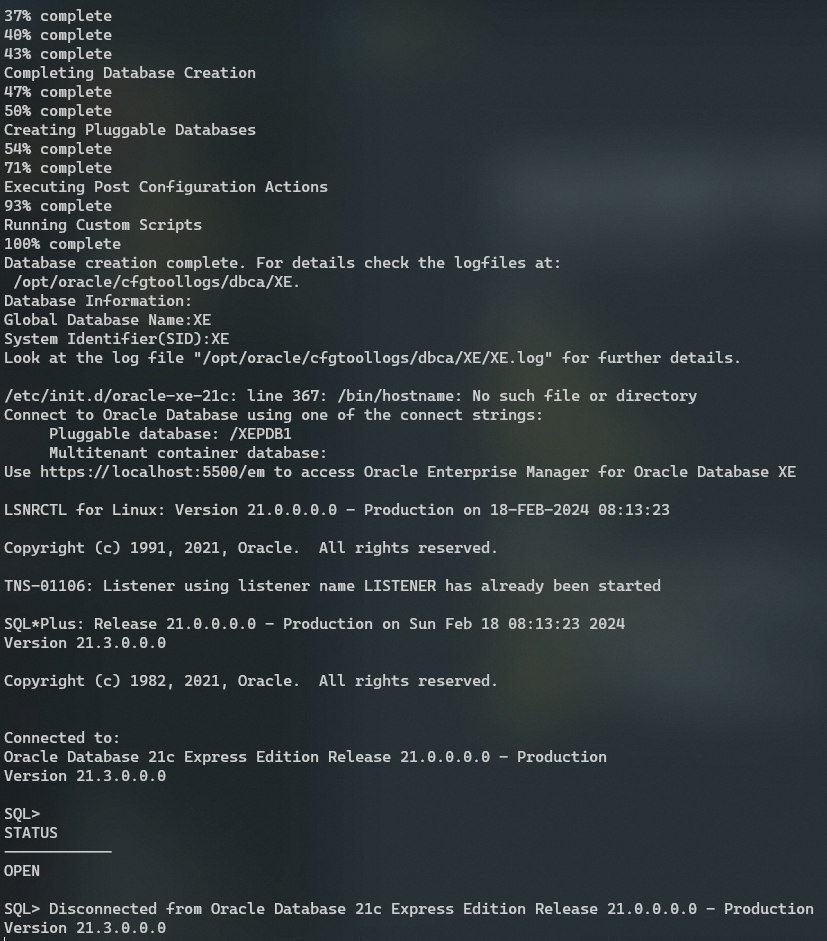

# Docker con Oracle Database 21c Express Edition

Se trata de un Docker Image lista para usar que contiene la base de datos Oracle 21c XE sobre Oracle Linux 8.4
El tamaño de esta imagen es de aprox. 9.1 GB comprimida, ya que la BD se instala con otro software.

## Prerequisitos

- Almenos 4 GB de RAM
- Almenos 25 GB de almacenamiento disponible
- Tener instalado WSL -> en caso de windows `wsl --install` ([Guía](https://www.youtube.com/shorts/ddfLijQ1t88))
- Tener instalado [Docker](https://docs.docker.com/get-docker/)
  - En Windows ([Guía](https://www.youtube.com/shorts/ddfLijQ1t88))
  - En MacOS ([Guía](https://www.youtube.com/watch?v=a30Enh1_aWI))

## Ejecutar Contenedor en Docker

Verifica si Docker Engine se está ejecutándose
_Se ejecuta cuando inicias Docker Desktop_


```bash
docker info
```

**Si no lo está, reiniciar el equipo y comprueba nuevamente.**

_Si hay contexión con Docker sigue los siguientes pasos:_

1. Descargar el proyecto desde el [repositorio de Github](https://github.com/iDylaan/docker-oracle-database-21c-xe)
 y descomprimelo (con esta carpeta nos referimos al proyecto)

2. Descargar [Oracle Database 21c Express Edition for Linux x64 (OL8)](https://www.oracle.com/mx/database/technologies/xe-downloads.html)
   
3. Ubicar el archivo RPM descargado en tu proyecto:
   Una vez descargado el archivo `oracle-database-xe-21c-1.0-1.ol8.x86_64.rpm`, deberás colocarlo en la carpeta raíz de tu proyecto. Esto permitirá que el `Dockerfile` lo utilice durante el proceso de construcción de la imagen.
   

**_Es necesario ejecutar los comandos desde la ruta raiz del proyecto, donde se encuentra el Dockerfile_**

4. Contruir la imagen docker

```bash
docker build -t oracle-21c-xe .
```


5. Ejecutar el contenedor por primera vez

```bash
docker run -d -p 1521:1521 --name oracle-db oracle-21c-xe
```

6. Revisar la inicialización de la base de datos

```bash
docker logs -f oracle-db
```

**_Esto puede tardar varios minutos_**, pero debes esperar hasta que cargue por completo y veas algo como esto: <br />



**¡Listo!** Ya puedes conectarse desde tu IDE preferido a Oracle Database 21c Express Edition, ya puedes cerrar la terminal.

7. Para iniciar nuevamente el contenedor
_Esto se usa una vez detienes el contenedor y lo quieres volver a iniciar_

```bash
docker start oracle-db
```

# **VARIABLES DE CONEXIÓN**

- Tipo: SYS_DBA
- Port: 1521
- SID: XE
- Username: sys
- Password: SYS_DBA_ADMIN_UTN

## Comandos Utiles

Verificar el contenedor

```bash
docker ps
```

Logs el contenedor
_Si necesitas ver los logs del contenedor_

```bash
docker logs oracle-db
```

Iniciar el contenedor con el Bash desde la terminal

```bash
docker run -it --name oracle-db-test oracle-21c-xe bash
```

Detener el contenedor

```bash
docker stop oracle-db
```

Eliminar el contenedor

```bash
docker rm oracle-db
```

Conectarse a la Base de Datos de Oracle como el SYS*DBA
\_Desde el CLI en la terminal*

```bash
sqlplus sys/SYS_DBA_ADMIN_UTN@XE as sysdba
```
