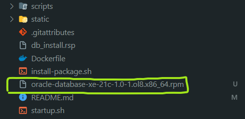

# Docker con Oracle Database 21c Express Edition

## Prerequisitos

- Instalar WSL en caso de windows `wsl --install`
- Instalar [Docker](https://docs.docker.com/get-docker/)
- Descargar [Oracle Database 21c Express Edition for Linux x64 ( OL8 )](https://www.oracle.com/mx/database/technologies/xe-downloads.html)

## Ejecutar Contenedor en Docker

Verifica si Docker está ejecutándose
```bash
docker info
```
**Si no lo está, reiniciar el equipo y comprueba nuevamente.**

*Si hay contexión con Docker sigue los siguientes pasos:*

Arrastrar el `.rpm` de **Oracle Database 21c Express Edition for Linux x64 ( OL8 )** en la carpeta raíz, debería quedar algo así: <br />


Contruir la imagen docker
```bash
docker build -t oracle-21c-xe .
```

Ejecutar el contenedor
```bash
docker run -d -p 1521:1521 --name oracle-db oracle-21c-xe
```

## Comandos Importantes

Verificar el contenedor
```bash
docker ps
```

Logs el contenedor
*Si necesitas ver los logs del contenedor*
```bash
docker logs oracle-db
```

Iniciar el contenedor con el Bash desde la terminal
```bash
docker run -it --name oracle-db-test oracle-21c-xe bash
```

Detener el contenedor
```bash
docker stop oracle-db
```

Eliminar el contenedor
```bash
docker rm oracle-db
```

Conectarse a la Base de Datos de Oracle como el SYS_DBA
*Desde el CLI en la terminal*
```bash
sqlplus sys/your_password@localhost:1521/XE as sysdba
```
**VARIABLES**
- Hostname: localhost
- Port: 1521
- SID: XE
- Username: tu_usuario
- Password: tu_contraseña
